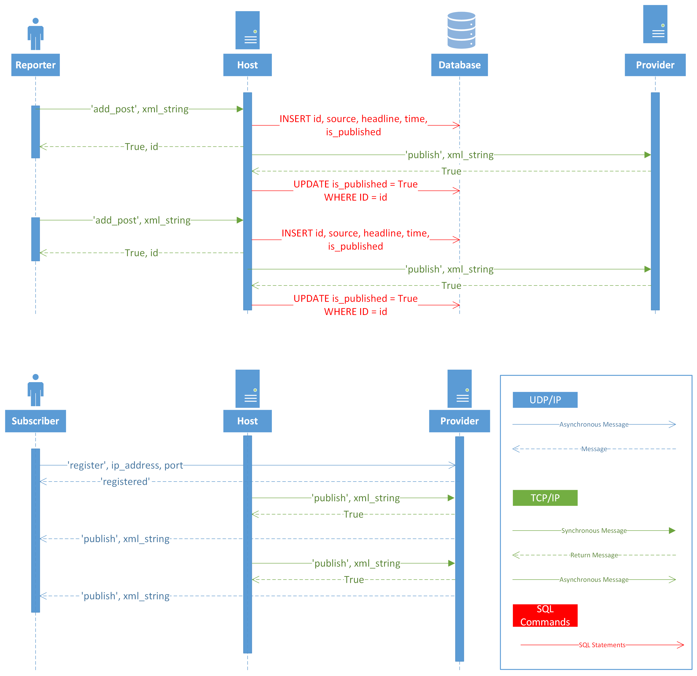

# What is RSSFeed?
Our system simulates an RSS feed, that consists of 5 types of components: 

1) Reporters: Reporter nodes send news headlines in XML strings through a TCP connection to the news host.  

2) Host: News Host stores data received from Reporters in a SQLite database and sends it to a Publisher using TCP. Additionally, the Host queues the data so it may resend it if previous attempts were unsuccessful. If the Host goes down before sending the received news, it will query the database for unsent news, when it recovers from failure. 

3) Publishers: Publisher listens for TCP connections from the news Host for the news. Upon receiving news from the Host, the Publisher sends the news data to its subscribers. The publisher registers subscribers by listening for them through a UDP socket.  

4) Subscribers: A node wanting to become a Subscriber sends the Publisher their address, and then the Publisher adds it to a map. Finally, the publisher sends news to each address in this map. Each Subscriber parses the XML received from Publisher into the news source and headline and prints it on the Screen 

5) SQLite Database: A simple database storing news received from reporters. 

# How does RSSFeed work?
Below are 2 sequence diagrams, the first highlighting communication from the perspective of the reporters. The second highlighting communication from the perspective of the subscribers. 

# Who Uses RSSFeed and What is its Goal?
We created RSSFeed for our distributed systems class at Seattle University. It is not intended to be used commercially.
This project is an academic exercise.

